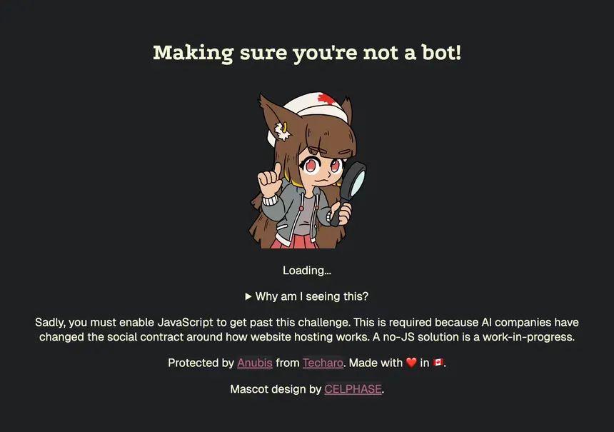
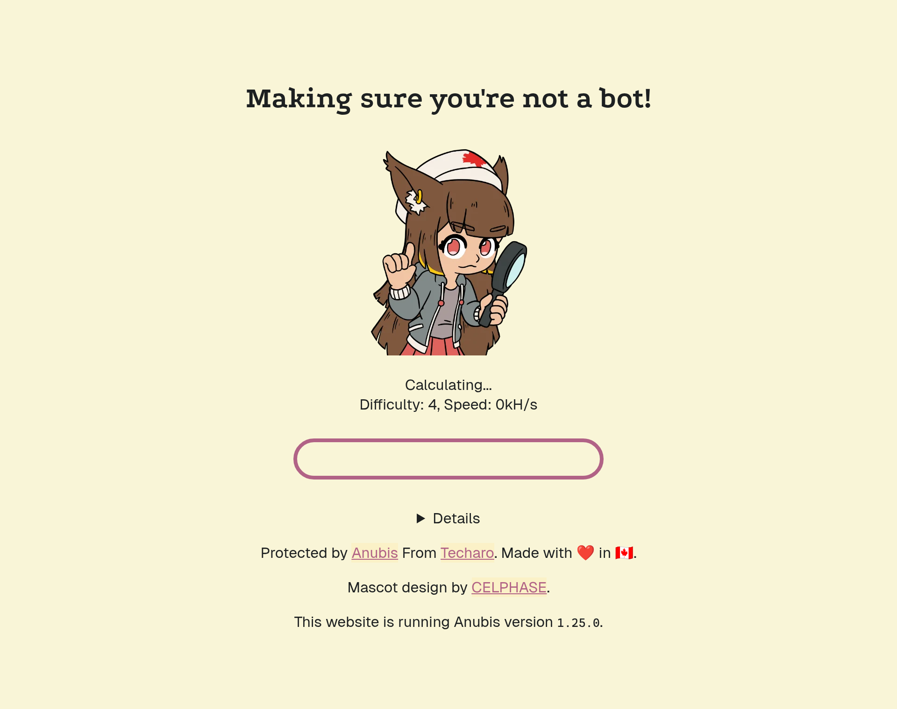

# Overview

## What is Anubis?

**Anubis** is an anti-bot system that sits in front of a web application. It uses challenges, including proof-of-work, to make automated requests more difficult and help distinguish bots from legitimate browser traffic.

It is useful for reducing unwanted scraping, automated abuse, and bot traffic. It is not a replacement for a firewall, authentication, or a WAF.

### This is how it looks in practice before redirecting



## Setup

In this setup, **Caddy** handles **HTTPS** and forwards requests to **Anubis**. **Anubis** then forwards verified requests to the Discount application.

**Browser** `-->` **Caddy :443** `-->` **Anubis :8080** `-->` **Discount :7001**

## Podman Compose

Create `compose.yml` anywhere:

```bash
services:
  anubis:
    image: ghcr.io/techarohq/anubis:latest
    container_name: anubis-discount
    restart: unless-stopped

    ports:
      - "127.0.0.1:8080:8080"

    environment:
      BIND: ":8080"
      TARGET: "http://host.containers.internal:7001"
      DIFFICULTY: "5"

    extra_hosts:
      - "host.containers.internal:host-gateway"
```

### Start Anubis:
```
# cd to the folder with compose.yaml in it
podman compose up -d
```

## Caddy

Configure **Caddy** to send `discount.homelab.com` to **Anubis**:
```
discount.homelab.com {
    tls internal

    reverse_proxy localhost:8080 {
        header_up X-Real-Ip {remote_host}
        header_up X-Http-Version {http.request.proto}
    }
}
```

### Validate and reload Caddy:
```bash
sudo caddy validate --config /etc/caddy/Caddyfile
sudo systemctl reload caddy
```

## The final traffic flow is:

**https://discount.homelab.com** `-->` **Caddy** `-->` **Anubis** `-->` **Discount**

**DIFFICULTY** controls the proof-of-work challenge difficulty. Increasing it makes automated requests more computationally expensive, but also increases the work required from legitimate users.

## **! Note:** 
If the application's port is still publicly accessible, Anubis can be bypassed by connecting directly to the application. This tutorial does not cover restricting or closing the application's port, so make sure it is not publicly accessible if you want all traffic to go through Anubis.